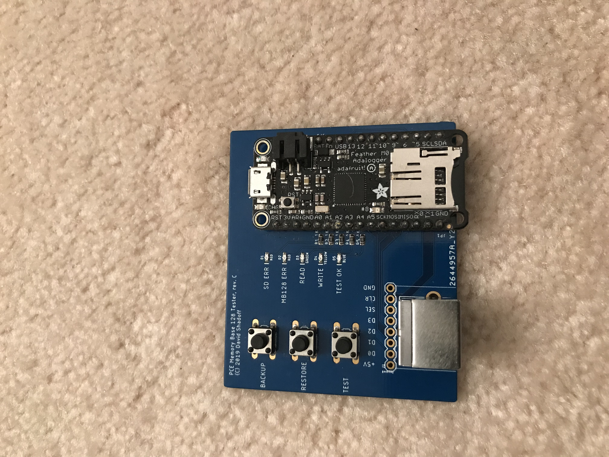
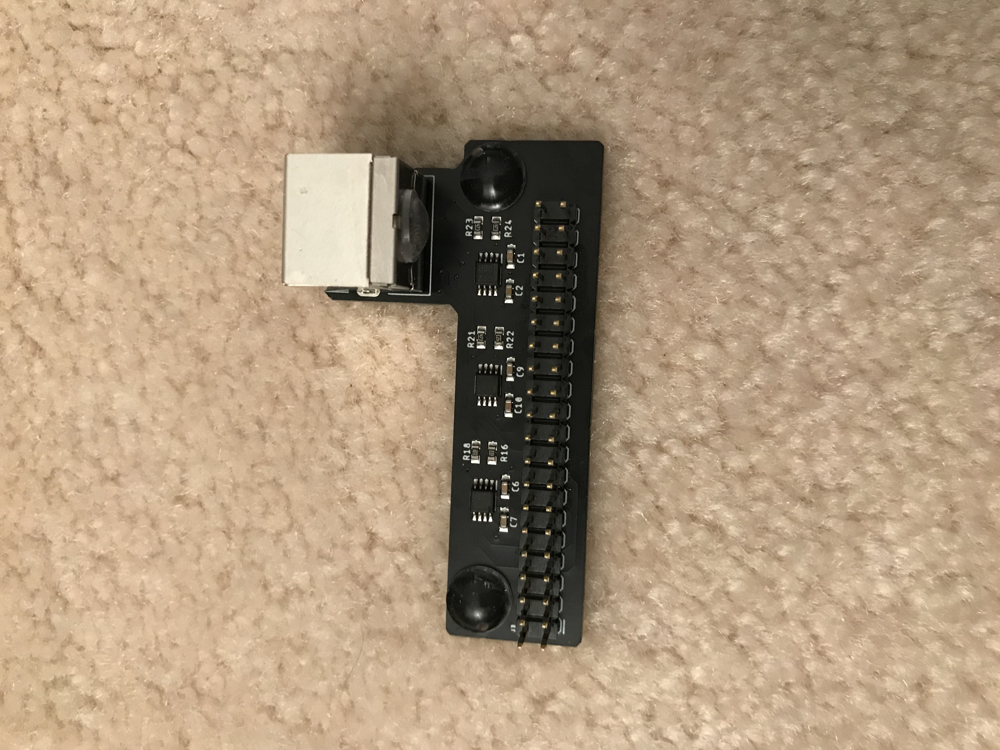

# MB128-Tester
This project contains both a PC board to control (Backup, Restore, Test) PC Engine
Memory Base 128 devices, as well as the control software for that PC board.

The original PC board is based on an 'Adafruit Feather M0 Adalogger' microcontroller board, which
directly interfaces to PC Engine Memory Base 128 devices.

There is also an updated version which is based on the Seeed Studios Wio Terminal device, which is
more of a finished all-in-one unit with a screen.

This repository holds the software which runs on those devices, as well as the boards' design files.

The sketch was built within the Arduino IDE, but I found that the digitalWrite() and digitalRead()
functions were too slow: ~1uS per call, when I needed 3 to 4 times that speed.

Moreover, they could only manipulate one pin at a time, when I generally needed to write 2, or read 4.

As a result, you will see direct port reads/writes to the Cortex M0 (or M4) ports... see the comments at the
top of the sketch if this is confusing.

(Note: Older versions of this sketch were written for an older version of the board, which didn't have
status LEDs or pushbutton switches, and automatically started to read the MB128 at boot-up time.)

Instructions on use:
--------------------

To use any of the functionality, ensure that the MB128 is plugged into the port, and an SDCard is
inserted into the SDCard slot of the Microcontroller board.  Finally, then attach the USB cable
in order to apply power ot the board.

M0 Adalogger board:
-------------------
A short self-test will take place, and all of the LEDs will flash briefly.  Once this has completed
and the Feather's green LED is on, you may press a button.

Wio Terminal:
-------------
A short self-test will take place, with status updates appearing on screen.  Once this has completed,
the screen will display a choice of operations (associated with the buttons across the top edge).

Backup:
-------
The device will backup the contents of the MB128 onto the SDCard, creating a file in the root
directory, with the filename: 'MB128_xx.SAV' (where 'xx' is a 2-digit number).  Multiple versions
of backups will be added to the SDCard until 99 versions have been reached.
A backup takes slightly over 10 seconds.

Restore:
--------
The device will use the highest-numbered 'MB128_xx.SAV' file in the root directory of the card,
and load the contents into the MB128.
A restore takes slightly over 10 seconds.

Test:
-----
The device will first create a temporary backup of the contents of the device, then will write,
read, and verify test patterns to all location on the MB128, finally restoring the original
contents.  The backup is saved into a file named 'TESTTEMP.BKP' in the root directory of the
SDCard.
A test takes slightly over one minute.

Error conditions:
-----------------
- If the 'SDCard Error' LED lights up at startup, there is a problem with the SDCard
- If the 'MB128 Error' LED lights up at startup, there is a problem with the MB128
(On the Wio Terminal version, clear error messages will appear on the screen).

- If either of the above LEDs go into a flashing state, this is an error which happened during
the process of reading or writing.  Please reset the device and/or turn the power off and back on

- In order to reset the device, there is a small pushbutton on the  microcontroller board. Do
not push this under normal circumstances, but you can press it if there is a flashing LED on
the MB128 reader.  If pressed, the MB128 may be interrupted in the middle of a protocol, causing
errors immedaitely afterward.  If this happens, unplug the MB128 from the reader, wait several
seconds, and plug it back in.  Then reset the microcontroller once again.
 

Additional information:
-----------------------
- If the USB is connected to a PC, and a terminal program is opened (19200 baud) for the
pseudo-serial port, messages indicating progress or errors will be displayed.

- Original Board (Adalogger M0)

- Wio Terminal (Rev. A, in use)

- Daughterboard

